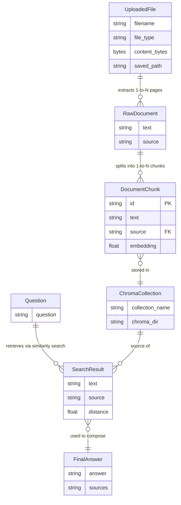

# 🗄️ Database Schema & Data Relationships

> **Developer Onboarding RAG Assistant**  
> This document describes the data models, storage layers, and entity relationships used throughout the system.

---

## 📦 Storage Overview

This project does **not** use a traditional relational database (e.g., PostgreSQL, MySQL).  
Instead, it uses two storage layers:

| Layer | Technology | Purpose |
|---|---|---|
| **Vector Store** | [ChromaDB](https://www.trychroma.com/) | Stores document chunks + embeddings for semantic search |
| **File System** | Local disk (`data/uploads/`) | Stores raw uploaded files (PDF, TXT, MD) |

---

## 🗂️ Entity Overview

```
UploadedFile
    │
    │  (1 file → many pages/sections)
    ▼
RawDocument
    │
    │  (1 document → many chunks via RecursiveCharacterTextSplitter)
    ▼
DocumentChunk  ←──────── stored in ──────────► ChromaDB Collection
    │                                               │
    │  (embedded via BGE model)                     │
    ▼                                               │
Embedding (vector[384])                             │
    │                                               │
    └──────────── queried by ─────────────► SearchResult
                                                    │
                                                    ▼
                                             LLM Prompt (OpenRouter)
                                                    │
                                                    ▼
                                              FinalAnswer
```

---

## 📄 Entities & Schemas

### 1. `UploadedFile`
> Represents a file uploaded by the user via the Streamlit UI / `/upload` API endpoint.

| Field | Type | Description |
|---|---|---|
| `filename` | `string` | Original filename (e.g., `guide.pdf`) |
| `file_type` | `enum` | `pdf`, `txt`, or `md` |
| `content_bytes` | `bytes` | Raw binary content of the file |
| `saved_path` | `path` | Location on disk: `data/uploads/<filename>` |

**Constraints:**
- Allowed types: `.pdf`, `.txt`, `.md` only — others raise `ValueError`.
- Saved to `UPLOAD_DIR = data/uploads/` (auto-created if missing).

---

### 2. `RawDocument`
> A logical unit of text extracted from an `UploadedFile`.  
> PDFs produce **one `RawDocument` per page**; TXT/MD produce **one `RawDocument` per file**.

| Field | Type | Description |
|---|---|---|
| `text` | `string` | Extracted plain text content |
| `source` | `string` | Human-readable citation string (see below) |

**`source` formats:**

| File Type | `source` Value Example |
|---|---|
| PDF | `"guide.pdf, page 3"` |
| TXT | `"readme.txt"` |
| Markdown | `"onboarding.md"` |

---

### 3. `DocumentChunk`
> A fixed-size segment of a `RawDocument`, created by `RecursiveCharacterTextSplitter`.  
> This is the **primary unit stored in ChromaDB**.

| Field | Type | Description |
|---|---|---|
| `id` | `uuid4 string` | Unique identifier, auto-generated |
| `text` | `string` | Chunk content (max 900 chars by default) |
| `source` | `string` | Inherited from parent `RawDocument` |
| `embedding` | `float[]` | 384-dimensional vector from BGE model |

**Chunking parameters** (from `rag/documents.py`):

| Parameter | Default | Description |
|---|---|---|
| `chunk_size` | `900` | Max characters per chunk |
| `chunk_overlap` | `150` | Overlapping characters between adjacent chunks |

---

### 4. `ChromaDB Collection` — `developer_docs`
> The ChromaDB collection that persists all `DocumentChunk` records.

**Collection config** (from `rag/config.py`):

| Config | Value |
|---|---|
| `COLLECTION_NAME` | `"developer_docs"` |
| `CHROMA_DIR` | `data/chroma/` |
| Client type | `PersistentClient` (disk-backed) |

**ChromaDB document record:**

| ChromaDB Field | Maps To | Type |
|---|---|---|
| `id` | `DocumentChunk.id` | `string (uuid4)` |
| `documents` | `DocumentChunk.text` | `string` |
| `embeddings` | `DocumentChunk.embedding` | `float[384]` |
| `metadatas.source` | `DocumentChunk.source` | `string` |

> **Note:** On every new `/upload`, the **entire collection is wiped** and re-indexed from scratch. Only the latest upload is queryable.

---

### 5. `SearchResult`
> Returned by a similarity query against the `developer_docs` collection.

| Field | Type | Description |
|---|---|---|
| `text` | `string` | Chunk text content |
| `source` | `string` | Citation string of the originating file |
| `distance` | `float` | L2 distance from query embedding (lower = more similar) |

**Filtering logic** (from `rag/chain.py`):

```python
threshold = float(os.getenv("SCORE_THRESHOLD", "1.0"))
relevant_matches = [m for m in matches if m["distance"] <= threshold]
```

---

### 6. `Question` (API Request)
> Pydantic model for the `/ask` endpoint request body.

| Field | Type | Description |
|---|---|---|
| `question` | `string` | The natural language question from the user |

---

### 7. `FinalAnswer` (API Response)
> The response returned from `/ask`, combining LLM output and source citations.

| Field | Type | Description |
|---|---|---|
| `answer` | `string` | LLM-generated answer text |
| `sources` | `string[]` | Deduplicated, sorted list of source citation strings |

---

## 🔗 Entity Relationships



---

## 🌐 API Endpoints & Data Flow

| Endpoint | Method | Input Entity | Output Entity |
|---|---|---|---|
| `/upload` | `POST` | `UploadedFile` | `{ filename, chunks, message }` |
| `/ask` | `POST` | `Question` | `FinalAnswer` |
| `/health` | `GET` | — | `{ status: "ok" }` |
| `/` | `GET` | — | `{ message: "..." }` |

---

## 🔄 Full Data Flow (Upload → Answer)

```
[User] uploads file via Streamlit
        │
        ▼
[app.py] POST /upload
        │
        ▼
[api.py] save_and_load(file)
        │
        ├─ PDF  → _load_pdf() → RawDocument[] (one per page)
        └─ TXT/MD → RawDocument[] (one per file)
        │
        ▼
[store.py] add_documents(docs)
        │
        ├─ Deletes existing ChromaDB collection
        ├─ Re-creates collection "developer_docs"
        ├─ split_text() → DocumentChunk[] (900 chars, 150 overlap)
        ├─ embed(chunks) → float[384][] via BGE model
        └─ collection.add(ids, documents, embeddings, metadatas)

[User] asks question via Streamlit
        │
        ▼
[app.py] POST /ask
        │
        ▼
[api.py] answer_question(question)
        │
        ▼
[store.py] search(question, limit=10)
        │
        ├─ embed([question]) → float[384]
        └─ collection.query() → SearchResult[] with distances
        │
        ▼
[chain.py] Filter by SCORE_THRESHOLD
        │
        ├─ Build context string from relevant_matches
        └─ POST to OpenRouter (Gemini / other LLM)
        │
        ▼
[chain.py] Return FinalAnswer { answer, sources }
```

---

## ⚙️ Configuration Reference

All settings live in `rag/config.py` and `.env`:

| Variable | Source | Default | Description |
|---|---|---|---|
| `DATA_DIR` | `config.py` | `data/` | Root data directory |
| `UPLOAD_DIR` | `config.py` | `data/uploads/` | Uploaded files directory |
| `CHROMA_DIR` | `config.py` | `data/chroma/` | ChromaDB persistence path |
| `COLLECTION_NAME` | `config.py` | `developer_docs` | ChromaDB collection name |
| `EMBEDDING_MODEL` | `config.py` | `BAAI/bge-small-en-v1.5` | HuggingFace embedding model |
| `OPENROUTER_MODEL` | `config.py` | `google/gemini-2.5-flash-lite` | LLM model via OpenRouter |
| `OPENROUTER_URL` | `config.py` | `https://openrouter.ai/api/v1/...` | OpenRouter API endpoint |
| `OPENROUTER_API_KEY` | `.env` | _(required)_ | API key for OpenRouter |
| `SCORE_THRESHOLD` | `.env` | `1.0` | Max L2 distance for relevant chunks |
| `API_URL` | `.env` | `http://localhost:8000` | FastAPI base URL for Streamlit |

---

## 📁 File System Layout

```
developer-onboarding-rag/
├── data/
│   ├── uploads/          ← Raw uploaded files (UploadedFile → saved_path)
│   └── chroma/           ← ChromaDB persistent vector store (DocumentChunk)
├── rag/
│   ├── config.py         ← Paths, model names, env vars
│   ├── documents.py      ← File loading + text chunking (RawDocument, DocumentChunk)
│   ├── embeddings.py     ← BGE embedding model (Embedding)
│   ├── store.py          ← ChromaDB CRUD + similarity search (SearchResult)
│   └── chain.py          ← RAG pipeline + LLM call (FinalAnswer)
├── api.py                ← FastAPI endpoints (Question, FinalAnswer)
└── app.py                ← Streamlit UI
```

---

> **Tip:** To extend this system with multi-user support or persistent history, consider adding a relational DB (e.g., SQLite or PostgreSQL) to track `User`, `Session`, and `QueryHistory` entities alongside the ChromaDB vector store.
